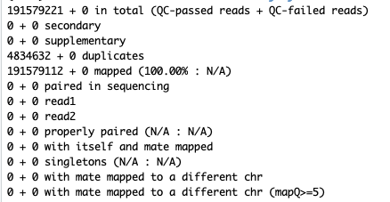

# Zwart lab standard workflow to merge ChIP-seq bam files for use in comparison profile plots -- instructions for the RHPC server

Provided are the Zwart lab approved basic steps to merge bam files from a ChIP-seq experiment to make comparison profile plots when running on the RHPC server.

## Vignette Info

Here we show the basic steps for merging filtered bam files in two different categories so that they can be compared in an ESeq/deepTools profile or heatmap for specific regions. This is a real-world example using real-world data **(thanks, Yanyun Zhu!)**. The data come from a ChIP-seq experiments of normal (healthy) and primary prostate cancer samples. Please do not disseminate or interpret these data, they are for instructional purposes only. 

Requirements for this tutorial are familiarity with:

- ChIP-seq 
- pre-/post-GCF course from Sebastian Gregoricchio and Tesa Severson
- Zwartlab snakePipes ChIP-seq pipeline written by former lab member Joe Siefert
- Upstream steps to merging including alignment of fastq.gz files to genome, filtering aligned files with MQ20

  
This vignette assumes you have aligned and filtered (MQ20) bam files for your samples of interest. This can be done by running peakcalling on your samples using the Zwartlab snakePipes ChIP-seq pipeline.

We also assume you have looked at the snakePipes ChIP-seq pipeline /QC_report/QC_report_all.tsv file for your experiments and have determined the read counts are enough (at least 20M reads/sample) and that QC metrics like Fraction of Reads in Peaks (FRiP) are acceptable and roughly similar between experiments (within ChIP-seq factors, eg. H3K27ac) and not significantly different between comparisons. If not or you do not know, ask for bioinformatic help, you may need to do additional sequencing.

In this tutorial for 2 categories of samples (Category A and B) we will merge the files of interest, index them, check their mapped reads and downsample accordingly.

**Zwart lab reproducibility means you observe these approved methods and do not deviate from them unless you have very specific scientific reasons**. In this case, ask for bioinformatic help.


 ## Merging and indexing of filtered bam files from Category A with samtools ##
Use samtools merge to create a new file `foxa1_healthy_2.bam` from the other mq20.bam files listed. Additionally, we use a flag to run this on 8 cores to speed up the process. Note, this will create a very big file as you are merging 10 bam files together. 

 ```bash
samtools merge -@10 foxa1_healthy_3.bam wz2086.mq20.bam wz2088.mq20.bam wz2090.mq20.bam 

samtools index foxa1_healthy_2.bam
```


 ## Check the mapped reads of the newly merged Category A file with samtools ##
Now use samtools flagstat to get the number of mapped reads in your new file. 
The new file `foxa1_healthy_2.bam` has 191579221 mapped reads. 

 ```bash
samtools flagstat foxa1_healthy_2.bam > foxa1_healthy_2.flag

cat foxa1_healthy_2.flag
```



## Downsample the Category A merged file to around 20 million reads and index the file ##
Next, we need to downample the new file to a managable size which is similar to most regular individual ChIP-seq samples in the lab (~20M reads). To do this we use samtools view subsample flag with the fraction of sample needed to reach target of 20M reads. 
For this example we simply divide 20M by the number of newly merged file mapped reads. 20,000,000/191,579,221 = 0.104395455


```bash
samtools view -s 0.10 foxa1_healthy_2.bam > foxa1_healthy_2_ds.bam

samtools index foxa1_healthy_2_ds.bam
```


sss
Run hichipper on the h3k27ac_outputs folder from HiC-Pro.
```bash
hichipper --out h3k27ac_hichipper --make-ucsc  hichipper.yaml
```


 ## Running a downsample experiment on the data ##
 
Need to use HTSeq to downsample the paired-end fastq files 

```bash
# install htseq with bioconda
conda create -c bioconda --name htseq htseq
conda activate htseq
```

For downsampling to 25% of reads
```bash
gunzip sample_R1.fastq.gz
gunzip sample_R1.fastq.gz
python subsample.py 0.25 sample_R1.fastq sample_R2.fastq sample_R1_ds25.fastq sample_R2_ds25.fastq
gzip -c sample_R1_ds25.fastq > sample_R1_ds25.fastq.gz
gzip -c sample_R2_ds25.fastq > sample_R2_ds25.fastq.gz
```

The subsample.py script is from the developer of HTSeq 
http://seqanswers.com/forums/archive/index.php/t-12070.html: 
It will throw a 'StopIteration' error but the files will be fine.

Next, run HiC-Pro on the downsampled samples

```bash
/home/t.severson/tools/HiC-Pro-2.11.1.install/bin/HiC-Pro -i ds_25/ -o ds_25_outputs -c config-hicpro.txt
````
Footer
