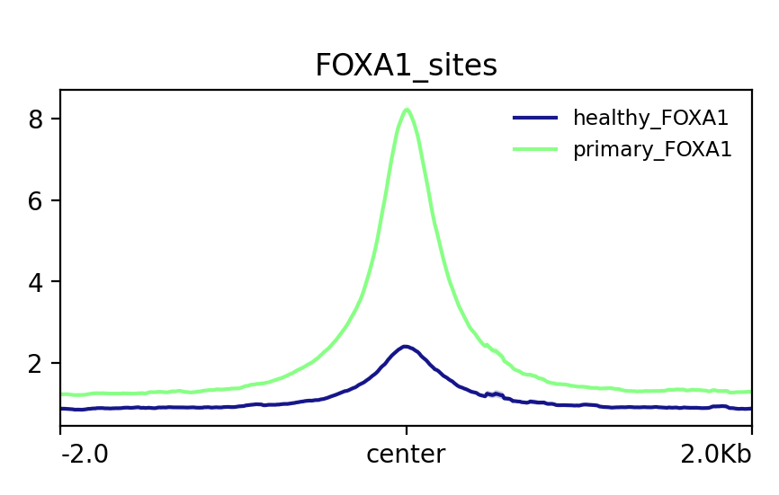
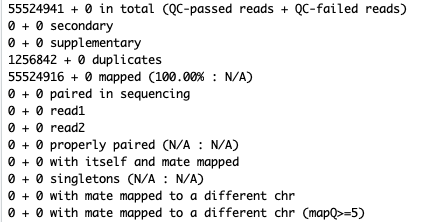
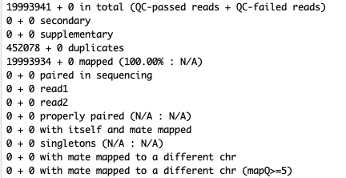

# Zwart lab standard workflow to merge ChIP-seq bam files for use in comparison profile/tornado heatmap plots -- instructions for the RHPC server

Provided are the Zwart lab approved basic steps to merge bam files from a ChIP-seq experiment to make comparison profile plots when running on the RHPC server.

## Vignette Info

With comparison plots, you can show the differences in signal strength for different groups of ChIP-seq data across a set (or sets) or regions of interest:



Some things to consider when comparing signal across datasets: you need to make sure that you don't see a difference in signal because one set of data has more samples than the other dataset(s). To avoid that, for each data set individually, we merge the filtered aligned bam files within the set, check the number of reads in the merged file and then downsample to a target number of reads (~20M). This way, when you have done this with all the sets you want to compare, you have datasets of roughly equivalent read counts. The resulting files can be used in an ESeq/deepTools profile or tornado/heatmap for your regions of interest. This is a realistic example of FOXA1 ChIP-seq data from normal (healthy) and primary prostate cancer samples. Please do not disseminate or interpret these data, they are for instructional purposes only. 

Requirements for this tutorial are familiarity with:

- ChIP-seq
- pre-/post-GCF course from Sebastian Gregoricchio and Tesa Severson
- Zwartlab snakePipes ChIP-seq pipeline written by former lab member Joe Siefert
- Upstream steps to merging including alignment of fastq.gz files to genome, filtering aligned files with MQ20
- samtools

  
This vignette assumes you have aligned and filtered (MQ20) bam files for your samples of interest. This can be done by running peakcalling on your samples using the Zwartlab snakePipes ChIP-seq pipeline.

We also assume you have looked at the snakePipes ChIP-seq pipeline /QC_report/QC_report_all.tsv file for your experiments and have determined the read counts are enough (at least 20M reads/sample) and that QC metrics like Fraction of Reads in Peaks (FRiP) are acceptable and roughly similar between experiments (within ChIP-seq factors, eg. H3K27ac) and not significantly different between comparisons. If not or you do not know, ask for bioinformatic help, you may need to do additional sequencing.

In this tutorial we want to compare 2 datasets of samples (datasetA and datasetB). First we will merge the files of interest, index them, check their mapped reads and downsample accordingly.

This is just one way to compare datasets in a normalized fashion. There are other (also correct) ways to do this, but this manner requires very few steps and is relatively convenient. 

## Merging and indexing of filtered bam (MQ20) files from datasetA (3 healthy tissue FOXA1 ChIP-seq samples) ##
Use samtools merge to create a new file `foxa1_healthy.bam` from the other filtered.bam files listed. 
Additionally, we use a flag to run this on 8 cores to speed up the process. Note, this will create a very 
big file as you are merging many bam files together. 

```bash
samtools merge -@8 foxa1_healthy.bam file1.filtered.bam file2.filtered.bam file3.filtered.bam 
samtools index foxa1_healthy.bam
```

## Check the mapped reads of the newly merged datasetA file ##
Now use samtools flagstat to get the number of mapped reads in your new file. 
The new file `foxa1_healthy.bam` has 55524941 mapped reads. You can see this from the top line of the .flag file  

```bash
samtools flagstat foxa1_healthy.bam > foxa1_healthy.flag
cat foxa1_healthy.flag
```



## Downsample datasetA file to roughly 20M reads ##
Use samtools view to downample a file (-b) by a fraction (-s) to obtain roughly 20M reads.

```bash
samtools view -s 0.36 -b foxa1_healthy.bam > foxa1_healthy_ds.bam
samtools index foxa1_healthy_ds.bam
```

## Double-check you now have rougly 20M reads in datasetA downsampled file

```bash
samtools flagstat foxa1_healthy_ds.bam > foxa1_healthy_ds.flag
cat foxa1_healthy_ds.flag
```



## Clean up -- remove non-downsampled files because they're very big ##

```bash
rm foxa1_healthy.bam
rm foxa1_healthy.bam.bai
```

## Do the same for datasetB files (4 primary tumor tissue FOXA1 ChIP-seq samples)## 

Based on the top line in the foxa1_primary.flag (N) file you can calculate the fraction (fraction_n) to input into the dowsample command to obtain close to 20M reads.

For example 20000000/N = fraction_n

```bash
samtools merge -@8 foxa1_primary.bam file1.filtered.bam file2.filtered.bam file3.filtered.bam file4.filtered.bam 
samtools index foxa1_primary.bam
samtools flagstat foxa1_primary.bam > foxa1_primary.flag
samtools view -s fraction_n -b foxa1_primary.bam > foxa1_primary_ds.bam
samtools index foxa1_primary_ds.bam
samtools flagstat foxa1_primary_ds.bam > foxa1_primary_ds.flag
rm foxa1_primary.bam
rm foxa1_primary.bam.bai
```

## You can now use these downsampled bam files to look at comparison plots ##
** Note, for deeptools, you'll first need to convert your files to bigwig. **
